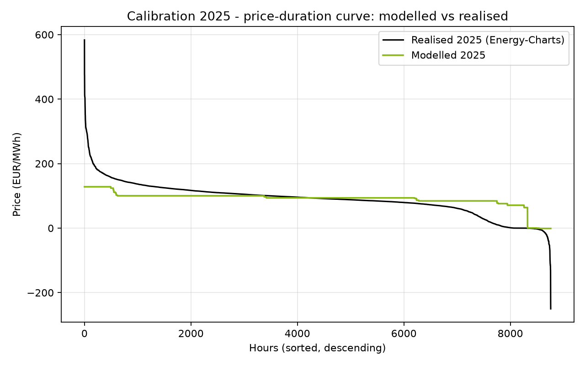
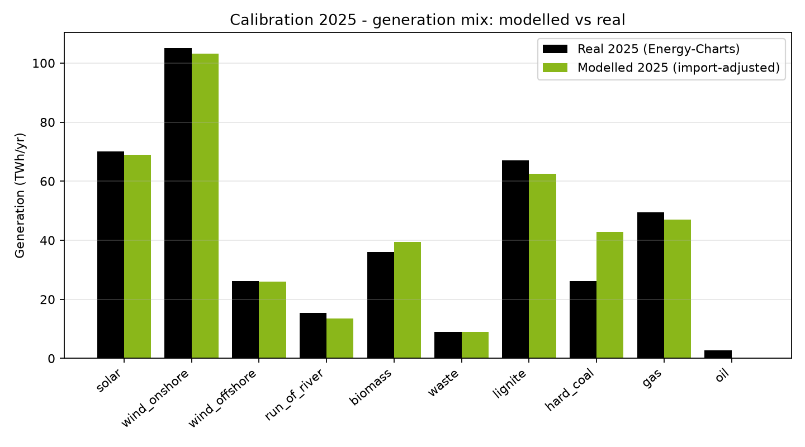

<div align="center">

# ⚡ Evaluating Germany's *Kraftwerksstrategie*

### An hourly PyPSA dispatch model of Germany's 2030 capacity remuneration mechanism

**Demand and Supply in Energy Markets Project · Ruhr-Universität Bochum (RUB) · 2026**

[](https://www.python.org/)
[](https://pypsa.org/)
[](https://highs.dev/)
[-orange)](https://www.energy-charts.info)
[](#-setup--how-to-run)
[](#-author--license)

*Does adding **10 GW of hydrogen-ready gas** actually change German electricity prices, CO₂ emissions
and security of supply in 2030? I built an hourly power-system model on authentic official data,
calibrated it against the realised 2025 market, ran it, and answered the question with reproducible
numbers — every one of which traces back to a results file produced by an actual model run.*

</div>

---

## 📌 Overview

This repository contains my evaluation of Germany's proposed capacity mechanism, the
**Kraftwerksstrategie**, carried out in two layers:

1. **A literature review** of capacity remuneration mechanisms (CRMs) — used for two concrete
   purposes: (i) to *classify* the mechanism I model within the CRM taxonomy, and (ii) to provide a
   yardstick against which to *compare* my modelled price and adequacy results.
2. **A PyPSA + HiGHS model** of the 2030 German power system — what actually happens when the
   policy's 10 GW of new hydrogen-ready combined-cycle gas (CCGT) is added.

I compare **Scenario A (no policy, 0 GW)** against **Scenario B (Kraftwerksstrategie, +10 GW)** over
all **8,760 hours** of the year. The model is calibrated to the **realised 2025 wholesale price
within 1.1%** and reproduces the realised 2025 generation mix carrier-by-carrier. Headline finding:
the policy **lowers and stabilises prices, sharply improves security of supply when imports are
unavailable, and cuts CO₂ and import dependence** — and, because the new plant is efficient, it even
lowers total system cost slightly.

The mechanism I model — firm capacity that is paid for availability **but still bids into and
dispatches in the wholesale market** — is a **(market-wide) capacity market**, as opposed to a
*strategic reserve* (capacity held outside the market and activated only in emergencies). This
classification follows the CRM taxonomy of Bublitz et al. (2019) and shapes how the results are read.

---

## 📑 Table of contents

- [Research question](#-research-question)
- [Two-layer approach](#-two-layer-approach)
- [Headline results (2030, A vs B)](#-headline-results-2030-a-vs-b)
- [Missing money & capacity remuneration](#-missing-money--capacity-remuneration)
- [Method at a glance](#-method-at-a-glance)
- [Repository structure](#-repository-structure)
- [Data & provenance](#-data--provenance)
- [Setup & how to run](#-setup--how-to-run)
- [Validation (beyond the mean)](#-validation-beyond-the-mean)
- [Scenarios & sensitivity](#-scenarios--sensitivity)
- [Known limitations](#-known-limitations)
- [Tech stack](#-tech-stack)
- [Key references](#-key-references)
- [Author & license](#-author--license)

---

## 🧭 Research question

Germany is removing firm, controllable capacity (nuclear is gone; coal is exiting under the KVBG)
while adding weather-dependent wind and solar toward the EEG-2023 target of **80 % renewables by
2030**. This revives a classic concern: will there be enough dependable power on a cold, dark,
windless winter evening? In its **Kraftwerksstrategie** — agreed in principle with the European
Commission on **15 January 2026** — the German government (BMWE) plans to tender **new
hydrogen-ready gas plants**, paid for *availability* rather than energy. That makes it a **capacity
remuneration mechanism (CRM)**.

> **Research question:** *In 2030, how does adding the Kraftwerksstrategie's firm capacity change
> Germany's security of supply, electricity prices, gas-fleet utilisation, CO₂ emissions, and the
> "missing money" that would justify a capacity payment?*

---

## 🧱 Two-layer approach

| Layer | What I did | Sources |
|---|---|---|
| **1 — Qualitative** | Reviewed the CRM literature, classified the policy as a capacity market, and derived testable price/adequacy hypotheses | Peer-reviewed literature & policy documents only |
| **2 — Quantitative** | Built, calibrated, and ran an hourly PyPSA dispatch model; compared Scenario A vs B | Only my own executed model output |

The two layers are kept strictly separate: **no model number appears in Layer 1, and Layer 2 uses
only values produced by running the model** and read from the results CSVs.

---

## 📊 Headline results (2030, A vs B)

All values are read directly from [`results/comparison_table.csv`](results/comparison_table.csv) and
[`results/islanded_sensitivity_2030.csv`](results/islanded_sensitivity_2030.csv) — the single source
of truth. The 2030 system is solved **twice** to bracket the import assumption: with capped
cross-border imports (≤ 20 GW) and **islanded** (no imports). Adequacy is reported islanded, because
with 20 GW of imports available neither scenario sheds load — the policy's adequacy value is
precisely its insurance against imports *not* being there.

| Metric | Without policy (A) | With policy (B) | Change |
|---|---:|---:|---:|
| Mean wholesale price (€/MWh) | 78.7 | 71.5 | **−9.1 %** |
| Price volatility, std. dev. (€/MWh) | 58.1 | 52.3 | **−10.0 %** |
| Loss-of-load hours — islanded (h/yr) | 121 | 13 | **−89 %** |
| Unserved energy — islanded (GWh/yr) | 1,432 | 97 | **−93 %** |
| Existing-gas CCGT full-load hours (h/yr) | 5,363 | 4,567 | **−14.8 %** |
| OCGT peaker full-load hours (h/yr) | 943 | 305 | **−67.7 %** |
| Renewable curtailment (% of VRE) | 10.9 | 10.9 | 0 % |
| CO₂ emissions (Mt/yr) | 86.0 | 73.5 | **−14.5 %** |
| Net electricity imports (TWh/yr) | 1.93 | 0.19 | **−90.4 %** |
| Consumer energy cost (bn €/yr) | 48.2 | 43.8 | **−9.2 %** |
| Total system cost (bn €/yr) | 21.41 | 20.87 | **−2.5 %** |

**In one line:** the +10 GW of efficient H₂-ready CCGT displaces costlier and dirtier generation, so
the average price and its volatility fall, existing gas and peakers run less, CO₂ and imports drop,
and — because the new plant is more efficient than what it displaces — the total system cost falls
slightly even after paying for the new build. The security-of-supply gain is large but conditional:
it is decisive only when cross-border imports are unavailable.

<div align="center">

| Price duration curve (A vs B) | Security of supply (A vs B, ± imports) |
|:---:|:---:|
|  |  |

</div>

---

## 💶 Missing money & capacity remuneration

Following the standard "missing-money" framing (Newbery 2016; Joskow 2008), I use the model's own
hourly prices to compute, for each firm plant, the **annual energy-market margin** (price × dispatch
− running cost) and compare it with the plant's **annualised fixed cost**. The shortfall is the
capacity payment the energy market alone cannot provide — read from
[`results/missing_money.csv`](results/missing_money.csv) and bracketed across the import assumption:

| Plant (Scenario B) | Annualised fixed cost | Energy-market margin | **Missing money** |
|---|---:|---:|---:|
| New H₂-ready CCGT | 79 €/kW·yr | covers fixed cost (both cases) | **0 €/kW·yr** |
| OCGT peaker — with imports | 35 €/kW·yr | 4 €/kW·yr | **31.6 €/kW·yr** |
| OCGT peaker — islanded | 35 €/kW·yr | exceeds fixed cost (scarcity rents) | **0 €/kW·yr** |

**Reading:** the efficient new CCGT recovers its fixed costs from energy-market revenue at ~4,900
full-load hours, so in this model it does **not** require a capacity payment. The *peaking* fleet is
where the missing-money problem bites — and only when imports suppress scarcity prices (0–32 €/kW·yr
depending on the import assumption). This is exactly the pattern the CRM literature predicts and
directly informs how a capacity payment should be targeted.

---

## 🔬 Method at a glance

- **Model type:** single-node (DE/LU "copper-plate") **hourly economic-dispatch** linear program —
  least-cost generation for each of the **8,760 hours**.
- **Tools:** [PyPSA](https://pypsa.org/) 1.2 (network building) + [HiGHS](https://highs.dev/)
  (open-source LP solver).
- **Reference years:** **2025** (real measured weather/demand/price → calibration) projected to
  **2030** (the policy year). 2030 demand is the 2025 hourly *shape* scaled to **600 TWh**
  (grid-load basis), implying a **97.4 GW** peak — matching the ENTSO-E TYNDP ~97 GW 2030 projection.
- **Price formation:** each hour's price = the marginal running cost of the most expensive dispatched
  plant. Running cost = `(fuel + CO₂·intensity) / efficiency + variable O&M`.
- **Scarcity pricing:** an uncapacitated load-shedding generator at the **Value of Lost Load
  (€4,000/MWh)** guarantees feasibility and prices shortage hours.
- **Realism without unit commitment:** three transparent must-run bands — biomass baseband,
  existing-CCGT CHP floor, and **waste-to-energy baseload** — anchor the heat-led / fuel-limited
  fleet to its real operation. Subsidised wind/solar bid negative in the 2025 calibration to
  reproduce negative-price hours.
- **Cross-border:** capped imports (≤ 20 GW at €180/MWh) represent interconnection in the 2030 runs.

---

## 🗂️ Repository structure

```
RUB-Kraftwerksstrategie/
├── data_loader.py            # 1) downloads & cleans authentic 2025 hourly data
├── config.py                 # all parameters & assumptions (single config, source-tagged)
├── model.py                  # 2) builds the PyPSA network, solves with HiGHS, writes results
├── requirements.txt          # Python dependencies
│
├── data/
│   ├── provenance.json       # full source / URL / units / retrieval log
│   └── processed/*.csv       # cleaned 2025 hourly inputs (committed; regenerated by data_loader.py)
│
├── results/                  # model output — the single source of truth
│   ├── comparison_table.csv             # A vs B headline metrics
│   ├── sensitivity_table.csv            # +5 / +10 / +20 GW
│   ├── islanded_sensitivity_2030.csv    # adequacy bracket (with imports vs islanded)
│   ├── missing_money.csv                # capacity-payment shortfall per plant
│   ├── scenario_A_hourly.csv            # 8,760-hour dispatch, Scenario A
│   ├── scenario_B_hourly.csv            # 8,760-hour dispatch, Scenario B
│   ├── calibration_2025_validation.csv  # modelled vs realised 2025 price distribution
│   └── calibration_2025_generation.csv  # modelled vs realised 2025 generation mix
│
├── figures/                  # fig1–fig9 (results + calibration)
├── report/                   # written report
├── LICENSE
└── README.md                 # you are here
```

---

## 🌐 Data & provenance

Every quantitative input comes from an official, citable provider. The **2025** series are *real
measured data*; the **2030** fleet and prices are *official targets and scenario assumptions*. Full
detail (URL, units, retrieval date) is logged in [`data/provenance.json`](data/provenance.json).

| Input | Value / series | Source |
|---|---|---|
| 2025 hourly demand, generation, price | real, measured (DE/LU) | **Fraunhofer ISE Energy-Charts** (re-publishing **Bundesnetzagentur/SMARD** & **ENTSO-E**, CC BY 4.0) |
| 2030 solar / onshore / offshore wind | 215 / 115 / 30 GW | **EEG 2023** / **WindSeeG** legal targets |
| 2030 lignite / hard coal | 9 / 8 GW | **Coal-Exit Act (KVBG)** |
| 2030 demand | 600 TWh (grid-load basis; peak ~97 GW) | **NEP Szenariorahmen 2025** / **ENTSO-E TYNDP** |
| Waste-to-energy capacity | ~1.3 GW (must-run baseload) | **BNetzA Kraftwerksliste** ("Abfall") |
| 2030 policy build | +10 GW H₂-ready CCGT | **BMWE Kraftwerksstrategie** (15 Jan 2026) |
| Fuel prices (gas/coal/CO₂) | TTF, ARA API2, EU ETS EUA — 2025 realised | **ICE / EEX / S&P Global Platts** |
| Technology costs & efficiencies | CAPEX, FOM, η | **Danish Energy Agency** Technology Catalogue |
| CO₂ emission factors | per fuel | **Umweltbundesamt** (CC 29/2022) |

---

## ⚙️ Setup & how to run

> The model runs locally (PyPSA needs a solver). I developed and ran it on **Windows + VS Code**;
> the steps below also work on macOS/Linux.

**1. Clone & enter the project**
```bash
git clone https://github.com/ahmadayy/RUB-Kraftwerksstrategie.git
cd RUB-Kraftwerksstrategie
```

**2. Create a virtual environment & install dependencies**
```bash
python -m venv venv
# Windows:
venv\Scripts\activate
# macOS / Linux:
source venv/bin/activate

pip install -r requirements.txt
```

**3. Run the two-step pipeline**
```bash
python data_loader.py     # downloads & cleans authentic 2025 data  -> data/processed/
python model.py           # builds, calibrates, solves all scenarios -> results/ + figures/
```

That's it — **two commands** reproduce every number and figure. No API key is required (the default
Energy-Charts data source is token-free). The processed inputs are committed, so `model.py` can be
re-run on its own.

---

## ✅ Validation (beyond the mean)

I do not validate on the mean price alone — a single-node LP can hit a mean by luck. I check the
whole 2025 price *distribution* and the generation mix carrier-by-carrier
([`results/calibration_2025_validation.csv`](results/calibration_2025_validation.csv),
[`results/calibration_2025_generation.csv`](results/calibration_2025_generation.csv)):

- **Mean price:** modelled **€90.3/MWh** vs realised **€89.3/MWh** → **+1.1 %**. Median within ~5 %.
- **Generation mix:** waste −0.2 %, solar −1.7 %, wind −1.8 %, offshore wind −0.2 %, gas −5.0 %,
  lignite −7.0 %, biomass +9.2 % — all within ~10 % of the realised Energy-Charts values.
- **Negative prices:** the EEG negative-bid reproduces **273** of the realised **576** negative-price
  hours — about half, without resorting to unit commitment.
- **Honestly stated gaps:** the model *over-states hard coal* (43 vs 26 TWh) and runs *oil at zero*
  (vs 2.8 TWh). These are documented single-node limitations, not tuning errors (see below). It also
  understates the extreme price tails (no start-up spikes), as a deterministic LP without unit
  commitment must.

The quantities the 2030 comparison actually relies on — the mean price level, the price-formation
order, and the renewable/gas/lignite shares — are the ones that validate well.

<div align="center">

| Calibration — price duration (2025) | Calibration — generation mix (2025) |
|:---:|:---:|
|  |  |

</div>

---

## 🔁 Scenarios & sensitivity

Scenarios are defined by **one lever** — the new-CCGT capacity (MW) — in [`config.py`](config.py):

```python
SCENARIOS = {
    "A":      0,        # No CRM (counterfactual)
    "B":      10000,    # Kraftwerksstrategie (canonical, 10 GW)
    "B_low":  5000,     # sensitivity
    "B_high": 20000,    # sensitivity
}
```

The effect scales monotonically with the build
([`results/sensitivity_table.csv`](results/sensitivity_table.csv)): mean price **75.0 → 71.5 → 66.6
€/MWh** for **+5 / +10 / +20 GW**, with CO₂ falling **79.4 → 73.5 → 64.8 Mt** and the new plant's
full-load hours easing from **5,234 → 4,929 → 4,277 h** as more capacity shares the same residual
demand. Everything else (demand, fuel/CO₂ prices, fleet, storage) also lives in `config.py`, each
value tagged with its source — so no number is hard-coded inside the model logic. Change a value,
re-run, and the results update consistently.

---

## ⚠️ Known limitations

I state these openly; the directions of every result are robust, some magnitudes are intentionally
rough:

1. **Single node** — ignores internal grid congestion, so curtailment is understated and the
   coal/gas split is imperfect.
2. **Hard-coal over-dispatch (the one real mix gap):** with a single average existing-CCGT block,
   hard coal (marginal cost ≈ €87/MWh) sits just below that block (≈ €97/MWh), so the LP runs coal
   before gas and over-states hard coal (43 vs 26 TWh). In reality Germany's *efficient* modern CCGTs
   out-compete hard coal while older units do not; one average block cannot reproduce that fleet
   heterogeneity. Capturing it would need an efficiency-tranche split, deliberately omitted to keep
   the design transparent. **The fuel price is the real ARA API2 value — the gap is structural, not
   forced.**
3. **Dispatch-only** — the 10 GW is imposed, not chosen; the model does not optimise *how much* to
   build.
4. **Perfect-foresight LP** — no forecast error, no unit commitment (start-up/ramping), no outages,
   so it under-represents the extreme price tails.
5. **One weather year (2025)** — the exact scarcity numbers are weather-sensitive.
6. **Wholesale resource cost only** — no taxes, levies, grid fees or subsidy transfers.

---

## 🧰 Tech stack

**Python** · **PyPSA** (power-system modelling) · **HiGHS** (LP solver) · **pandas** / **NumPy**
(data handling) · **Matplotlib** (figures) · **requests** (Energy-Charts API).

---

## 📚 Key references

- Brown, T., Hörsch, J., & Schlachtberger, D. (2018). *PyPSA: Python for Power System Analysis.* Journal of Open Research Software, 6(1), 4.
- Huangfu, Q., & Hall, J. A. J. (2018). *Parallelizing the dual revised simplex method* (HiGHS). Mathematical Programming Computation, 10(1), 119–142.
- Bublitz, A., Keles, D., Zimmermann, F., Fraunholz, C., & Fichtner, W. (2019). *A survey on electricity market design: capacity remuneration mechanisms.* Energy Economics, 80, 1059–1078.
- Bhagwat, P. C., Iychettira, K. K., Richstein, J. C., Chappin, E. J. L., & De Vries, L. J. (2017). *The effectiveness of capacity markets in the presence of a high portfolio share of renewables.* Utilities Policy, 48, 76–91.
- Cramton, P., & Stoft, S. (2005). *A capacity market that makes sense.* The Electricity Journal, 18(7), 43–54.
- Joskow, P. L. (2008). *Capacity payments in imperfect electricity markets.* Utilities Policy, 16(3), 159–170.
- Newbery, D. (2016). *Missing money and missing markets.* Energy Policy, 94, 401–410.
- Sanchez Jimenez, I., Johanndeiter, S., & de Vries, L. J. (2025). *Capacity remuneration mechanisms for power systems in transition* [Preprint]. SSRN. https://ssrn.com/abstract=5196543

*Full APA-7 reference list and the per-number source table are in the report.*

---

## 👤 Author & license

**Author:** Muhammad Ahmad Khan — Demand and Supply in Energy Markets Project, Ruhr-Universität
Bochum, 2026.

**Data:** © respective providers; Energy-Charts data under **CC BY 4.0**.
**Code:** released under the **MIT License** — free to use with attribution.

> *If you use or build on this work, a citation to the report and this repository is appreciated.*
