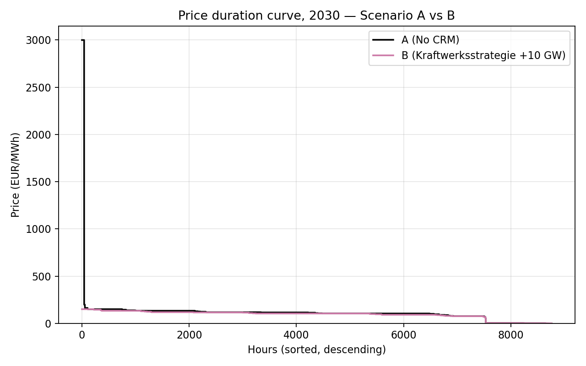
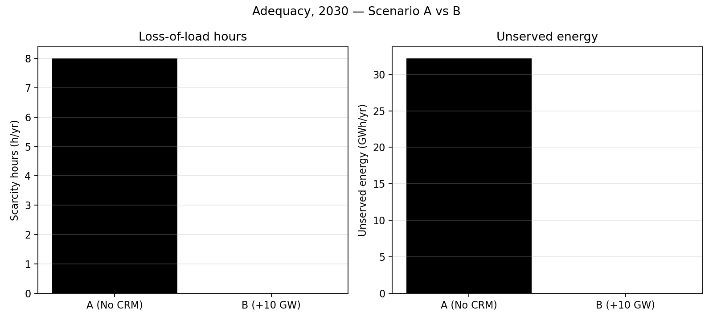

<div align="center">

# ⚡ Evaluating Germany's *Kraftwerksstrategie*

### An hourly PyPSA dispatch model of Germany's 2030 capacity remuneration mechanism

**Group project · Ruhr-Universität Bochum (RUB) · June 2026**

[](https://www.python.org/)
[](https://pypsa.org/)
[](https://highs.dev/)
[-orange)](https://www.energy-charts.info)
[](#-setup--how-to-run)
[](#-author--license)

*Does adding **10 GW of hydrogen-ready gas** actually change German electricity prices, CO₂ emissions
and security of supply in 2030? I built an hourly power-system model on authentic official data, ran
it, and answered the question with verified numbers.*

</div>

---

## 📌 TL;DR

I evaluated Germany's proposed capacity mechanism, the **Kraftwerksstrategie**, in two layers:

1. **A literature review** of capacity remuneration mechanisms (CRMs) — what theory predicts.
2. **My own PyPSA + HiGHS model** of the 2030 German power system — what actually happens when I add
   the policy's 10 GW of new hydrogen-ready combined-cycle gas (CCGT).

I compared **Scenario A (no policy, 0 GW)** against **Scenario B (Kraftwerksstrategie, +10 GW)** over
all **8,760 hours** of the year. The model is calibrated to the **real 2025 wholesale price within
0.4%**. Headline finding: the policy **removes the residual supply shortfall, lowers and stabilises
prices, and cuts CO₂ and imports** — and, because the new plant is efficient, it even lowers total
system cost slightly.

---

## 📑 Table of contents

- [Motivation & research question](#-motivation--research-question)
- [Two-layer approach](#-two-layer-approach)
- [Headline results (2030, A vs B)](#-headline-results-2030-a-vs-b)
- [Method at a glance](#-method-at-a-glance)
- [Repository structure](#-repository-structure)
- [Data & provenance](#-data--provenance)
- [Setup & how to run](#-setup--how-to-run)
- [What the model produces](#-what-the-model-produces)
- [Scenarios & how to change them](#-scenarios--how-to-change-them)
- [Validation & integrity](#-validation--integrity)
- [Known limitations](#-known-limitations)
- [Deliverables](#-deliverables)
- [Tech stack](#-tech-stack)
- [Key references](#-key-references)
- [Author & license](#-author--license)

---

## 🧭 Motivation & research question

Germany is removing firm, controllable capacity (nuclear is gone, coal is exiting under the KVBG) while
adding weather-dependent wind and solar toward the EEG 2023 target of **80% renewables by 2030**. This
revives a classic concern: will there be enough dependable power on a cold, dark, windless winter
evening? In its **Kraftwerksstrategie** — agreed in principle with the European Commission on
**15 January 2026** — the German government (BMWE) plans to tender **new hydrogen-ready gas plants**,
paid for *availability* rather than energy. That makes it a **capacity remuneration mechanism (CRM)**.

> **Research question:** *In 2030, how does adding the Kraftwerksstrategie's firm capacity change
> Germany's security of supply, electricity prices, gas-fleet utilisation, and CO₂ emissions?*

---

## 🧱 Two-layer approach

| Layer | What I did | Sources |
|---|---|---|
| **1 — Qualitative** | Reviewed the CRM literature, classified the policy in the CRM taxonomy, and derived testable price/adequacy hypotheses | Peer-reviewed literature & policy documents only |
| **2 — Quantitative** | Built, calibrated, and ran an hourly PyPSA dispatch model; compared Scenario A vs B | Only my own executed model output |

The two layers are kept strictly separate: **no model number appears in Layer 1, and Layer 2 uses
only values produced by running the model.**

---

## 📊 Headline results (2030, A vs B)

All values are read directly from `results/comparison_table.csv` — the single source of truth.

| Metric | Without policy (A) | With policy (B) | Change |
|---|---:|---:|---:|
| Mean wholesale price (€/MWh) | 113.0 | 92.6 | **−18.1%** |
| Price volatility, std. dev. (€/MWh) | 205.0 | 40.2 | **−80.4%** |
| Scarcity / loss-of-load hours (h/yr) | 8 | 0 | **−100%** |
| Unserved energy (GWh/yr) | 32.2 | 0.0 | **−100%** |
| Existing-gas CCGT full-load hours (h/yr) | 5,517 | 4,926 | **−10.7%** |
| Renewable curtailment (%) | 2.5 | 2.5 | 0% |
| CO₂ emissions (Mt/yr) | 101.3 | 88.7 | **−12.4%** |
| Net electricity imports (TWh/yr) | 7.1 | 1.6 | **−77.9%** |
| Total system cost (bn €/yr) | 26.75 | 25.80 | **−3.5%** |

**In one line:** the +10 GW removes the residual supply shortfall, strips out the extreme price
spikes (so the average and volatility fall sharply), dilutes existing-gas use, and lowers CO₂ and
imports — while the efficient plant displaces costlier generation, so total cost slightly *falls*.

<div align="center">

| Price duration curve (A vs B) | Security of supply (A vs B) |
|:---:|:---:|
|  |  |

</div>

---

## 🔬 Method at a glance

- **Model type:** single-node (DE/LU "copper-plate") **hourly economic-dispatch** model — a linear
  program that finds the least-cost generation mix for each of the **8,760 hours**.
- **Tools:** [PyPSA](https://pypsa.org/) (network building) + [HiGHS](https://highs.dev/) (open-source LP solver).
- **Reference years:** **2025** (real measured weather/demand/price → calibration) projected to
  **2030** (the policy year).
- **Price formation:** each hour's price = the marginal (running) cost of the most expensive plant
  needed — the standard market-clearing mechanism. Running cost = `(fuel + CO₂·intensity) / efficiency + variable O&M`.
- **Scarcity pricing:** an uncapacitated load-shedding generator at the **Value of Lost Load
  (€3,000/MWh)** guarantees feasibility and prices shortage hours.
- **Cross-border:** capped imports (≤20 GW at €150/MWh) represent interconnection in the 2030 runs.

---

## 🗂️ Repository structure

```
RUB-Kraftwerksstrategie/
├── data_loader.py            # 1) downloads & cleans authentic 2025 hourly data
├── config.py                 # all parameters & assumptions (single config, source-tagged)
├── model.py                  # 2) builds the PyPSA network, solves with HiGHS, writes results
├── requirements.txt          # Python dependencies
│
├── data/
│   ├── processed/            # demand / capacity-factor / price / generation — 2025 hourly CSVs
│   ├── raw/                  # raw API pulls
│   └── provenance.json       # full source / URL / units / retrieval log
│
├── results/                  # ← model output (single source of truth)
│   ├── comparison_table.csv          # A vs B headline metrics
│   ├── sensitivity_table.csv         # +5 / +10 / +20 GW
│   ├── scenario_A_hourly.csv         # 8,760-hour dispatch, Scenario A
│   ├── scenario_B_hourly.csv         # 8,760-hour dispatch, Scenario B
│   └── calibration_2025_validation.csv
│
├── figures/                  # fig1–fig7 (results) + codeA–codeD (annotated code)
├── report/report.docx        # full written report (Layers 1 & 2)
├── presentation.pptx         # RUB-themed slide deck
├── EVALUATION.md             # honest, sceptical self-assessment
├── DATA_VERIFICATION.md      # every input verified against official sources
└── README.md                 # you are here
```

---

## 🌐 Data & provenance

Every quantitative input comes from an official, citable provider. The **2025** series are *real
measured data*; the **2030** fleet and prices are *official targets and scenario assumptions*. Full
detail (URL, units, retrieval date) is logged in [`data/provenance.json`](data/provenance.json) and
verified in [`DATA_VERIFICATION.md`](DATA_VERIFICATION.md).

| Input | Value / series | Source |
|---|---|---|
| 2025 hourly demand, generation, price | real, measured (DE/LU) | **Fraunhofer ISE Energy-Charts** (re-publishing **Bundesnetzagentur/SMARD** & **ENTSO-E**, CC BY 4.0) |
| 2030 solar / onshore / offshore wind | 215 / 115 / 30 GW | **EEG 2023** / **WindSeeG** legal targets |
| 2030 lignite / hard coal | 9 / 8 GW | **Coal-Exit Act (KVBG)** |
| 2030 demand | 680 TWh | **NEP Szenariorahmen 2025** |
| 2030 policy build | +10 GW H₂-ready CCGT | **BMWE Kraftwerksstrategie** (15 Jan 2026) |
| Technology costs & efficiencies | CAPEX, FOM, η | **Danish Energy Agency** Technology Catalogue (via PyPSA technology-data) |
| CO₂ emission factors | per fuel | **Umweltbundesamt** (CC 29/2022) |

---

## ⚙️ Setup & how to run

> The model runs locally (PyPSA needs a solver). I developed and ran it on **Windows + VS Code**;
> the steps below also work on macOS/Linux. A detailed beginner walkthrough is in
> [`RUN_IN_VSCODE.md`](RUN_IN_VSCODE.md).

**1. Clone & enter the project**
```bash
git clone https://github.com/<your-username>/RUB-Kraftwerksstrategie.git
cd RUB-Kraftwerksstrategie
```

**2. Create a virtual environment & install dependencies**
```bash
python -m venv venv
# Windows:
venv\Scripts\activate
# macOS / Linux:
source venv/bin/activate

pip install -r requirements.txt
```

**3. Run the two-step pipeline**
```bash
python data_loader.py     # downloads & cleans authentic 2025 data  -> data/processed/
python model.py           # builds, calibrates, solves all scenarios -> results/ + figures/
```

That's it — **two commands** reproduce every number and figure in the report and the slides. No API
key is required (the default Energy-Charts data source is token-free).

---

## 📤 What the model produces

Running `model.py` writes, into `results/` and `figures/`:

- **`comparison_table.csv`** — the A-vs-B headline metrics (the numbers used everywhere downstream).
- **`sensitivity_table.csv`** — the same metrics for +5 / +10 / +20 GW.
- **`scenario_A_hourly.csv` / `scenario_B_hourly.csv`** — full 8,760-hour dispatch and price.
- **`calibration_2025_validation.csv`** — modelled vs realised 2025 price.
- **`fig1`–`fig7`** — price duration curve, seasonal & weekly dispatch, gas utilisation, curtailment,
  scarcity, and the model schematic.

---

## 🔁 Scenarios & how to change them

Scenarios are defined by **one lever** — the new-CCGT capacity (MW) — in [`config.py`](config.py):

```python
SCENARIOS = {
    "A":      0,        # No CRM (counterfactual)
    "B":      10000,    # Kraftwerksstrategie (canonical, 10 GW)
    "B_low":  5000,     # sensitivity
    "B_high": 20000,    # sensitivity
}
```

Everything else (demand, fuel/CO₂ prices, fleet, storage) also lives in `config.py`, each value
**tagged with its source** — so I never hard-code a number inside the model logic. Change a value,
re-run `python model.py`, and the results update consistently.

---

## ✅ Validation & integrity

- **Calibration:** my modelled 2025 mean price is **€89.72/MWh** vs the realised market **€89.33/MWh**
  → **0.4% error** (`calibration_2025_validation.csv`).
- **Single source of truth:** every model number in the report and the presentation is read directly
  from `comparison_table.csv` — I verified programmatically that **report ≡ presentation ≡ CSV**,
  cell-for-cell.
- **Internal consistency:** headline metrics re-derive two ways (e.g. CCGT full-load hours from
  generation ÷ capacity matches the dispatch sum).
- **Inputs verified:** all `[VERIFY]` assumptions checked against official sources in
  [`DATA_VERIFICATION.md`](DATA_VERIFICATION.md).

---

## ⚠️ Known limitations

I state these openly (full detail in [`EVALUATION.md`](EVALUATION.md)):

1. **Single node** — ignores internal grid congestion, so curtailment is understated and gas use overstated.
2. **Dispatch-only** — the 10 GW is imposed, not chosen; the model does not optimise *how much* to build.
3. **Perfect-foresight LP** — no forecast error, no unit commitment (start-up/ramping), no outages.
4. **One weather year (2025)** — the exact scarcity numbers are weather-sensitive.
5. **Wholesale resource cost only** — no taxes, levies, subsidy transfers or consumer-bill components.

These are normal, clearly-bounded simplifications for a study at this level. The **directions** of
every result are robust; some **magnitudes** are intentionally rough.

---

## 📦 Deliverables

| File | What it is |
|---|---|
| [`report/report.docx`](report/report.docx) | Full written report — literature review + model evaluation |
| [`presentation.pptx`](presentation.pptx) | RUB-themed slide deck (Part 1 literature, Part 2 model) |
| [`EVALUATION.md`](EVALUATION.md) | Sceptical self-assessment: sanity checks, verdict, fixes |
| [`DATA_VERIFICATION.md`](DATA_VERIFICATION.md) | Every input verified against official sources |

---

## 🧰 Tech stack

**Python** · **PyPSA** (power-system modelling) · **HiGHS** (LP solver) · **pandas** / **NumPy**
(data) · **Matplotlib** (figures) · **requests** (Energy-Charts API) · **python-docx** / **python-pptx**
(deliverables).

---

## 📚 Key references

- Brown, T., Hörsch, J., & Schlachtberger, D. (2018). *PyPSA: Python for Power System Analysis.* Journal of Open Research Software, 6(1), 4.
- Huangfu, Q., & Hall, J. A. J. (2018). *Parallelizing the dual revised simplex method* (HiGHS). Mathematical Programming Computation, 10(1), 119–142.
- Bublitz, A., et al. (2019). *A survey on electricity market design: capacity remuneration mechanisms.* Energy Economics, 80, 1059–1078.
- Bhagwat, P. C., et al. (2017). *The effectiveness of capacity markets… high share of renewables.* Utilities Policy, 48, 76–91.
- Cramton, P., & Stoft, S. (2005). *A capacity market that makes sense.* The Electricity Journal, 18(7), 43–54.
- Joskow, P. L. (2008). *Capacity payments in imperfect electricity markets.* Utilities Policy, 16(3), 159–170.
- Newbery, D. (2016). *Missing money and missing markets.* Energy Policy, 94, 401–410.

*Full APA-7th reference list is in the report.*

---

## 👤 Author & license

**Author:** *Muhammad Ahmad Khan* — Demand and Supply in Energy Markets, Ruhr-Universität Bochum, June 2026.

**Data:** © respective providers; Energy-Charts data under **CC BY 4.0**.
**Code:** released under the **MIT License** — free to use with attribution.

> *If you use or build on this work, a citation to the report and this repository is appreciated.*
